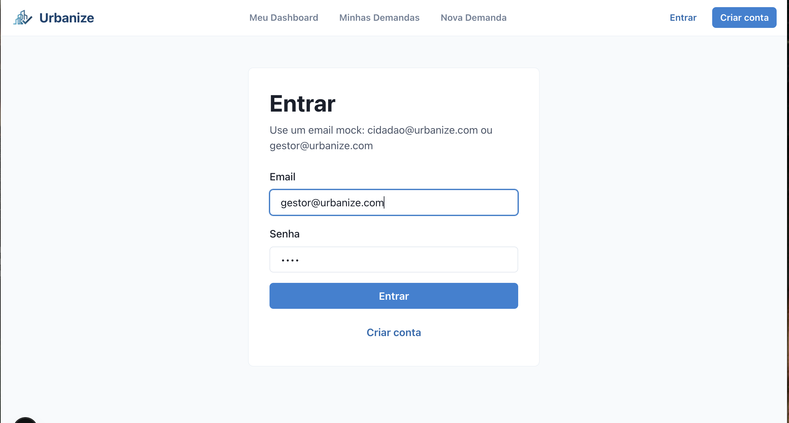

# Urbanize

> Plataforma de gestão de demandas urbanas com diferenciação de perfis (Cidadão e Gestor)


**Stack:** Next.js 16 • TypeScript • Chakra UI • Tailwind • Zustand • MSW

## Início rápido

```bash
# Instalar dependências
npm install

# Rodar servidor de desenvolvimento
npm run dev -- --hostname 127.0.0.1 --port 4100

# Acessar
 http://127.0.0.1:4100
```

**Credenciais de teste:**
- Cidadão: `cidadao@urbanize.com` / `demo`
- Gestor: `gestor@urbanize.com` / `demo`

<details>
<summary>Scripts disponíveis</summary>

- `npm run dev` - Servidor de desenvolvimento
- `npm run build` - Build de produção
- `npm run start` - Servir build
- `npm run lint` - Executar linter

</details>

<details>
<summary>Solução de problemas</summary>

**Porta ocupada:**
```bash
lsof -ti tcp:4100 | xargs kill
```

**Mudar porta:**
```bash
npm run dev -- --hostname 127.0.0.1 --port 4101
```

</details>

## Funcionalidades principais

### Autenticação e perfis

O sistema detecta automaticamente o perfil do usuário pelo email:

- `@cidadaourbanize.com` → Perfil **Cidadão**
- `@gestorurbanize.com` → Perfil **Gestor**
- Outros domínios → Perfil **Cidadão** (padrão)



### Perfil Cidadão

**Permissões:**
- ✅ Criar novas demandas
- ✅ Visualizar suas próprias demandas
- ✅ Acompanhar status e timeline
- ✅ Consultar métricas pessoais
- ❌ Alterar status de demandas
- ❌ Acessar painel do gestor

**Navegação:**
- `/dashboard` - Visão geral pessoal
- `/demandas` - Minhas demandas
- `/demandas/nova` - Criar nova demanda
- `/demandas/:id` - Detalhes da demanda

<details>
<summary>Ver jornada completa do cidadão</summary>

Consulte a [documentação de jornadas](docs/jornada-usuario.md) para fluxos detalhados, permissões e cenários de teste.

</details>

### Perfil Gestor

**Permissões:**
- ✅ Visualizar todas as demandas da cidade
- ✅ Alterar status de demandas
- ✅ Adicionar observações
- ✅ Revisar triagem automática (mock)
- ✅ Visualizar métricas gerais
- ❌ Criar novas demandas

**Navegação:**
- `/gestor` - Painel de gestão
- `/demandas` - Todas as demandas
- `/demandas/:id` - Gerenciar demanda


<details>
<summary>Ver jornada completa do gestor</summary>

Consulte a [documentação de jornadas](docs/jornada-usuario.md) para fluxos detalhados, permissões e cenários de teste.

</details>

### Proteção de rotas

O sistema implementa controle de acesso automático:

- Usuários não autenticados → Redirecionados para `/login`
- Cidadão tentando acessar `/gestor` → Redirecionado para `/dashboard`
- Gestor tentando acessar `/dashboard` ou `/demandas/nova` → Redirecionado para `/gestor`

### Triagem inteligente (Mock)

Demonstração de funcionalidade futura com IA:
- Classificação automática de categoria
- Sugestão de órgão responsável
- Score de confiança
- Pronto para integração com backend


## Estrutura do projeto

```
src/
├── app/                    # Páginas Next.js (App Router)
│   ├── api/               # API Routes (mock)
│   ├── cadastro/          # Página de cadastro
│   ├── dashboard/         # Dashboard do cidadão
│   ├── demandas/          # Listagem e detalhes
│   ├── gestor/            # Painel do gestor
│   └── login/             # Página de login
├── components/            # Componentes React
│   ├── auth/             # Proteção de rotas
│   ├── common/           # Componentes genéricos
│   ├── dashboard/        # Cards de métricas
│   ├── demandas/         # Cards, filtros, timeline
│   ├── feedback/         # Loading, error, empty states
│   ├── forms/            # Formulários
│   ├── layout/           # Navbar, footer, layout
│   └── ui/               # Badges, títulos
├── hooks/                # Custom hooks
├── mocks/                # MSW handlers
├── services/             # Camada de API
├── store/                # Zustand stores
├── types/                # TypeScript types
└── utils/                # Funções auxiliares
```

<details>
<summary>Ver estrutura detalhada</summary>

**Stores (Zustand):**
- `authStore` - Autenticação e usuário (com persist)
- `demandStore` - Demandas e filtros
- `uiStore` - Estado da UI

**Services:**
- `api.ts` - Mock da API com localStorage
- `authService.ts` - Login e registro
- `demandService.ts` - CRUD de demandas
- `metricsService.ts` - Métricas e estatísticas

**Hooks:**
- `useAuth` - Gerenciamento de autenticação
- `useDemands` - Gerenciamento de demandas
- `useFilters` - Filtros e busca
- `useMetrics` - Métricas e estatísticas

</details>

## Documentação

📖 **[Jornadas e Perfis de Usuário](docs/jornada-usuario.md)**  
Fluxos detalhados, permissões, matriz de proteção de rotas e guia de testes

📋 **[Requisitos da Avaliação 1](docs/requisitos-urbanize.md)**  
Checklist completo de conformidade com todos os requisitos implementados

## Recursos técnicos

**Frontend:**
- Next.js 16.2.4 (App Router)
- TypeScript 5.7.3 (strict mode)
- Chakra UI 2.10.9 (sistema de design)
- Tailwind CSS 4.2.2
- React 19.1.0

**Estado e dados:**
- Zustand 5.0.12 (gerenciamento de estado)
- MSW 2.13.1 (mock de API)
- Axios 1.15.2 (cliente HTTP)
- localStorage (persistência mock)

**Qualidade:**
- ESLint 9.39.4
- TypeScript strict mode
- Componentes de feedback (loading/error/empty)
- Validação de formulários

**Design:**
- Totalmente responsivo (mobile, tablet, desktop)
- Sistema de cores customizado
- Dark mode support (Chakra UI)
- Acessibilidade (ARIA labels)

<details>
<summary>Dependências completas</summary>

```json
{
  "next": "16.2.4",
  "react": "19.1.0",
  "@chakra-ui/react": "2.10.9",
  "tailwindcss": "4.2.2",
  "zustand": "5.0.12",
  "msw": "2.13.1",
  "axios": "1.15.2",
  "typescript": "5.7.3"
}
```

</details>

## Notas de desenvolvimento

**API Mock:**  
A aplicação usa MSW (Mock Service Worker) para simular uma API completa. Os dados são armazenados no localStorage do navegador, permitindo persistência entre recarregamentos. Pronto para substituição por backend real.

**Detecção de perfil:**  
Implementado em `src/utils/roleDetection.ts`. Detecta automaticamente o perfil pelo domínio do email no momento do login/cadastro.

**Proteção de rotas:**  
Componente `RoleProtectedRoute` em `src/components/auth/` verifica autenticação e permissões antes de renderizar páginas protegidas.

**Estados visuais:**  
Todos os componentes de lista implementam loading states (skeleton), empty states e error states para melhor UX.

## Avaliação 1 - Status

✅ **Stack obrigatória:** Next.js, TypeScript, Chakra UI  
✅ **10 funcionalidades MVP:** Todas implementadas  
✅ **Páginas obrigatórias:** Home, Login, Cadastro, Dashboard, Gestor, Demandas  
✅ **Extras:** Diferenciação de perfis, proteção de rotas, triagem mock, métricas  
✅ **Responsividade:** Mobile, tablet e desktop  
✅ **Estados de feedback:** Loading, error, empty em todas as listas

Consulte [docs/requisitos-urbanize.md](docs/requisitos-urbanize.md) para checklist completo.

## Demo e Deploy

**Deploy:** https://urbanize-eta.vercel.app/

**Vídeo demonstrativo:** https://drive.google.com/file/d/18r728n8keNXeKZlQN2OaagseRG1cEEZP/view?usp=sharing

## Próximos passos

- [ ] Integração com backend real
- [ ] Implementação de IA para triagem
- [ ] Sistema de notificações
- [ ] Upload de fotos em demandas
